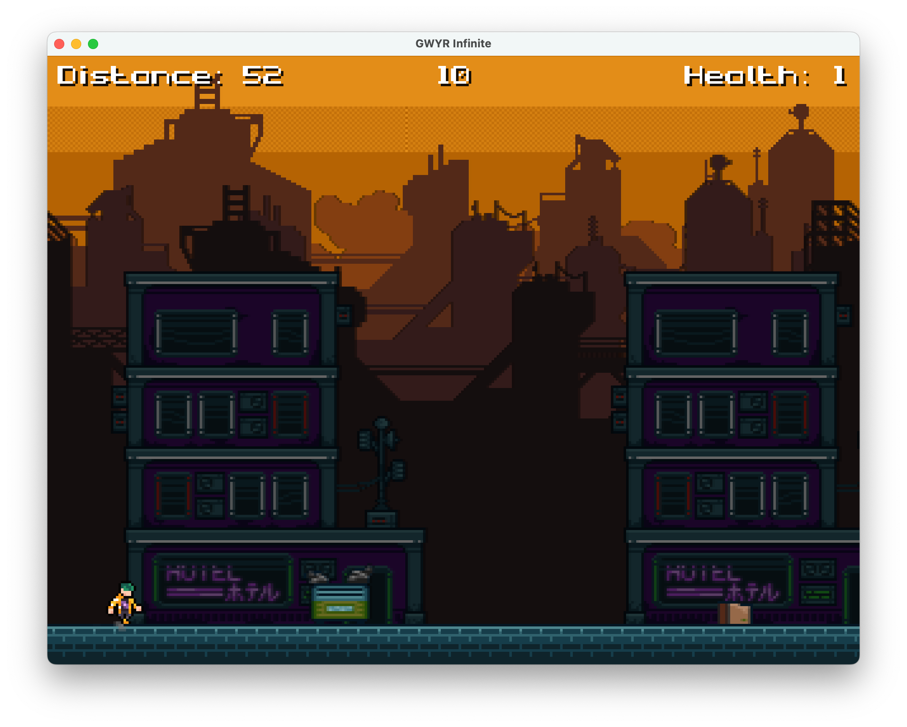

# GWYR Infinite

("Game Where You Run" Infinite; yes, it's a bad pun on "infinite runner" 😎)

An infinite runner game built with Odin and Raylib. Pretty much the "follow up" to
[Infinite Ruster](https://github.com/brlywk/infinite_ruster), but this time trying
to create a "full" game with menus, game settings, etc.

## Motivation
A more "serious" learning project for game development. I somewhat recently had the
spontaneous idea to try out Odin and Raylib on a train ride (see [Odin Arcade](https://github.com/brlywk/odin_arcade)),
and really started to like the language. So I thought to myself: "Why not try to recreate
my Infinite Ruster learning project with a little bit more meat on its bones?"

## Installation
Make sure you have [Odin](https://odin-lang.org/docs/install/) installed. Personally, I cloned
the repo and used the provided build scripts.

### Debug mode / flags
You can run the game in debug mode using `odin run . -debug` to see more verbose logging
and collision rectangles for the player and all obstacles.

You can also use the `NO_COLLISION` config flag to test out functionality without collision
detection:

`odin run . -debug -define:NO_COLLISION=true`

## Controls

### Menus

- Navigation: `Arrow Up/Down`, `W/S`, `K/J`
- Selection: `Space`
- Back / Close Menu: `Escape`

### In-Game
- Jump: `Space`
- Pause Menu: `Escape`

## Notes

Game development without an engine is hard! 😁 This project was an amazing learning opportunity,
and although I know there is still a lot that can be improved and/or polished, I consider this
game "finished" for the time being.

## Assets

Not all assets used are free to use, some of them have been licensed (mostly through Humble Bundle
sales over the years...). Please refer to the [`readme.md`](./assets/readme.md) in the `assets/` folder for more information
about which assets have been used and whether you can re-use them as-is.
